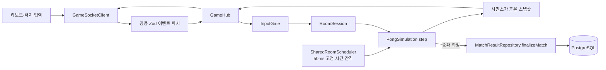
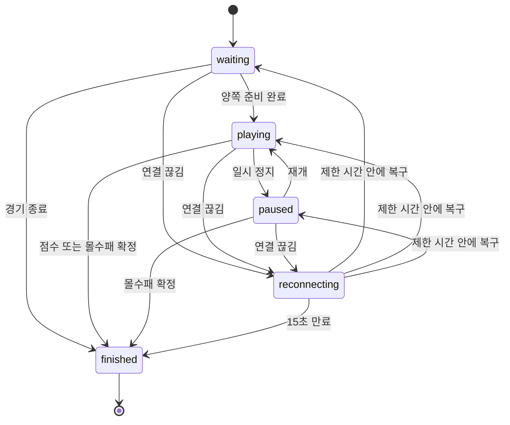
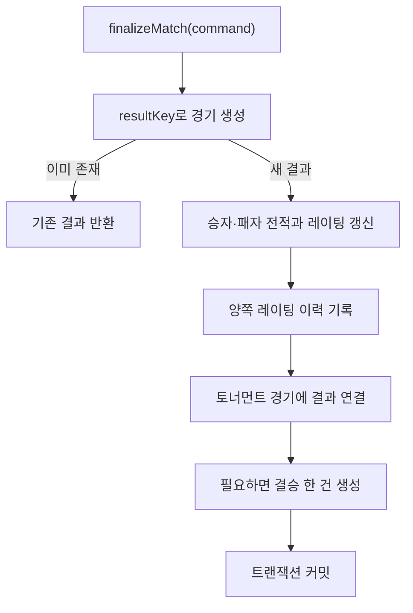

# 서버 구조와 경기 처리 흐름

한 경기가 만들어져 종료되고 저장되는 흐름을 현재 코드 기준으로 정리했습니다. 문제가 생겼을 때 어느 모듈부터 확인해야 하는지도 함께 설명합니다.

## 모듈별 책임

- `packages/shared`는 HTTP와 WebSocket 입출력 형식을 Zod 스키마로 정의합니다. API와 웹은 여기서 같은 타입과 파서를 가져다 씁니다.
- `apps/api/src/gameHub.ts`는 연결, 명령 전달, 방 생명주기, 브로드캐스트를 조정합니다.
- `apps/api/src/game/pongSimulation.ts`의 `PongSimulation.step`은 네트워크와 데이터베이스를 참조하지 않습니다. 현재 상태, 양쪽 입력과 경과 시간을 받아 다음 상태를 돌려줍니다.
- `apps/api/src/game/pongAi.ts`는 방 식별자를 시드로 삼아 같은 조건에서 같은 입력을 만듭니다.
- `apps/api/src/game/roomSession.ts`는 준비, 일시 정지, 재접속, 종료 전이를 맡습니다.
- `apps/api/src/game/sharedRoomScheduler.ts`는 실행 중인 방을 하나의 50ms 고정 시간 간격으로 순회합니다.
- `packages/db`는 SQL 마이그레이션, 행 변환, `Database` 테이블 타입과 경기 결과 트랜잭션을 관리합니다.

## 서버 권한 흐름

클라이언트는 패들 방향만 보냅니다. 공의 위치와 점수는 서버가 계산하며, 클라이언트가 보낸 게임 상태를 신뢰하지 않습니다.

`FixedStepAccumulator`는 `performance.now()`를 기준으로 경과 시간을 누적합니다. 한 번의 루프에서 최대 5틱만 따라잡고, 누적 지연은 250ms에서 잘라 장시간 정지 뒤에 계산이 한꺼번에 몰리지 않도록 합니다. 스케줄러 비교는 `tests/load/scheduler-benchmark.mjs`로 다시 실행할 수 있으며, 기록된 결과는 `docs/measurements/scheduler-2026-07-24.json`에 있습니다.

## 방 상태

방의 상태는 `RoomSession` 한 곳에서 바뀝니다. 연결이 끊기면 원래 상태를 기억한 채 `reconnecting`으로 이동합니다. 15초 안에 양쪽 연결이 복구되면 이전 상태로 돌아가고, 한쪽만 돌아오지 않으면 상대방 승리로 종료합니다. 양쪽이 모두 돌아오지 않으면 결과를 저장하지 않고 방을 정리합니다.

## 경기 결과 트랜잭션

일반 사용자 경기는 방마다 만든 `resultKey`를 멱등 키로 사용합니다. 같은 종료 요청이 여러 번 들어오면 첫 트랜잭션이 만든 결과를 반환하고 전적과 레이팅을 다시 계산하지 않습니다. 비회원 경기는 이 저장 경로를 호출하지 않으며 `persisted: false`, `matchId: null`로 끝납니다.

토너먼트 참가도 토너먼트 행을 잠근 뒤 정원 확인, 시드 배정, 참가자 추가, 대진표 생성을 한 트랜잭션에서 처리합니다. 친구 관계는 두 사용자 ID를 정렬한 조합이 하나만 남도록 DB 제약 조건과 저장소 로직을 함께 둡니다.

## 웹 상태 관리

일반 HTTP 데이터는 TanStack Query가 맡습니다. `apps/web/src/lib/query.ts`에 쿼리 키와 변경 요청 뒤 무효화 대상을 모아 두었습니다. 게임 연결은 `GameSocketClient → useGameConnection → 상태 전이 함수 → UI` 순서로 흐르며, 상태 전이 함수는 `idle`, `connecting`, `matching`, `waitingReady`, `playing`, `paused`, `reconnecting`, `finished`, `failed`만 사용합니다.

입력 필드가 활성화되거나 문서가 숨겨질 때는 같은 명령 경로로 방향 `0`을 즉시 보냅니다. 키보드와 터치가 별도 상태를 만들지 않기 때문에 한쪽 입력이 남아 패들이 계속 움직이는 경우를 줄일 수 있습니다.
