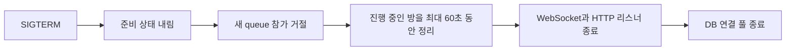

# 운영 준비와 장애 확인

Compose에는 상태 검사, 일회성 마이그레이션, 정상 종료와 지표 수집이 마련되어 있습니다. 실제 레지스트리, 호스팅, 외부 DB, 도메인과 운영 비밀 값 연결은 포함하지 않습니다.

## 컨테이너 시작 순서

프로덕션 Compose는 소스 바인드 마운트를 사용하지 않습니다. 다단계 이미지에서 빌드한 `dist`와 Next.js 독립 실행 결과만 사용하며, API와 웹 프로세스는 루트 권한이 없는 사용자로 실행됩니다.

시작 순서는 다음과 같습니다.

1. PostgreSQL 상태 검사가 통과합니다.
2. `migrate` 일회성 작업이 SQL 마이그레이션을 적용하고 종료합니다.
3. API가 마이그레이션 완료를 확인한 뒤 시작합니다.
4. 웹과 Caddy가 준비된 서비스로 요청을 전달합니다.

애플리케이션 컨테이너가 시작할 때 `install`, `build`, 마이그레이션, 시드를 다시 수행하지 않습니다.

## 상태 확인

- `/health/live`는 Node 프로세스가 요청을 처리할 수 있는지만 확인합니다.
- `/health/ready`는 수명 주기, PostgreSQL 연결, 필요한 마이그레이션 적용 여부를 함께 확인합니다. 하나라도 준비되지 않았거나 종료를 준비하는 중이면 503을 반환합니다.
- `/metrics`는 Prometheus 형식으로 연결 수, 방 수, 이벤트 루프 지연, 스냅샷과 경기 결과 확정 상태를 제공합니다. Caddy 공개 경로에서는 막고 내부망에서만 수집합니다.

준비 상태 응답에는 DB 예외나 접속 문자열을 넣지 않습니다. 외부 감시에는 상태와 안정된 검사 이름만 노출합니다.

## 종료 절차

`SIGTERM`이나 `SIGINT`를 받으면 다음 순서로 종료합니다.

신호가 여러 번 와도 종료 절차는 한 번만 시작합니다. 제한 시간 안에 끝나지 않은 방이 있으면 60초 뒤 남은 연결을 닫고 프로세스를 종료합니다.

## 로그와 비밀값

요청 로그에는 요청 ID를 붙이고, 경기 로그에는 사용자·방·경기 ID를 연결할 수 있는 필드를 사용합니다. 쿠키, 인증 헤더, 티켓은 기록하지 않습니다. 쿼리 전체도 남기지 않아 WebSocket 티켓이나 개인 입력이 로그로 흘러가지 않도록 합니다.

`APP_MODE=demo` 또는 `APP_MODE=production`에서는 32바이트 이상인 `SESSION_SECRET`이 없으면 API가 시작되지 않습니다. 프로덕션 비밀값을 저장소나 Compose 기본값에 넣지 않습니다.

## 부하와 장애 주입

부하 시나리오는 k6, 네트워크 장애는 Toxiproxy로 실행합니다. 최소 확인 기준은 다음과 같습니다.

- 연결 500개, 방 50개
- 연결 성공률 99% 이상
- 재접속 성공률 99% 이상
- 스냅샷 지연 p95 150ms 이하, p99 250ms 이하
- 이벤트 루프 지연 p95 50ms 이하
- 정상 클라이언트의 스냅샷 누락 1% 미만
- 중복 또는 실패한 경기 결과 확정 0건

연결 1,000개는 실행 장비가 감당할 때만 추가로 측정합니다. 결과에는 CPU, 메모리, Docker 자원 제한과 실행 시간을 함께 기록합니다. 기준을 통과한 단일 인스턴스에는 Redis를 넣지 않습니다. 실패 원인이 프로세스 메모리의 대기열·접속 상태나 방 소유권으로 확인된 경우에만 Redis와 다중 인스턴스 검증을 다음 작업으로 엽니다.

## 문제를 좁히는 순서

1. `/health/live`가 실패하면 프로세스와 종료 신호 로그를 확인합니다.
2. 실행 상태는 정상이고 `/health/ready`만 실패하면 PostgreSQL 연결과 마이그레이션 상태를 확인합니다.
3. 스냅샷 지연만 커지면 이벤트 루프 지연, 활성 방 수와 누락 수를 같은 시간대에 비교합니다.
4. 경기 결과 확정 오류가 있으면 `resultKey`, 트랜잭션 롤백, DB 지연을 확인합니다. 같은 경기의 재시도는 새 키를 만들지 않습니다.
5. 재접속 실패는 티켓 발급, 15초 보존 시간과 이전 연결 교체 순서로 나눠 확인합니다.
