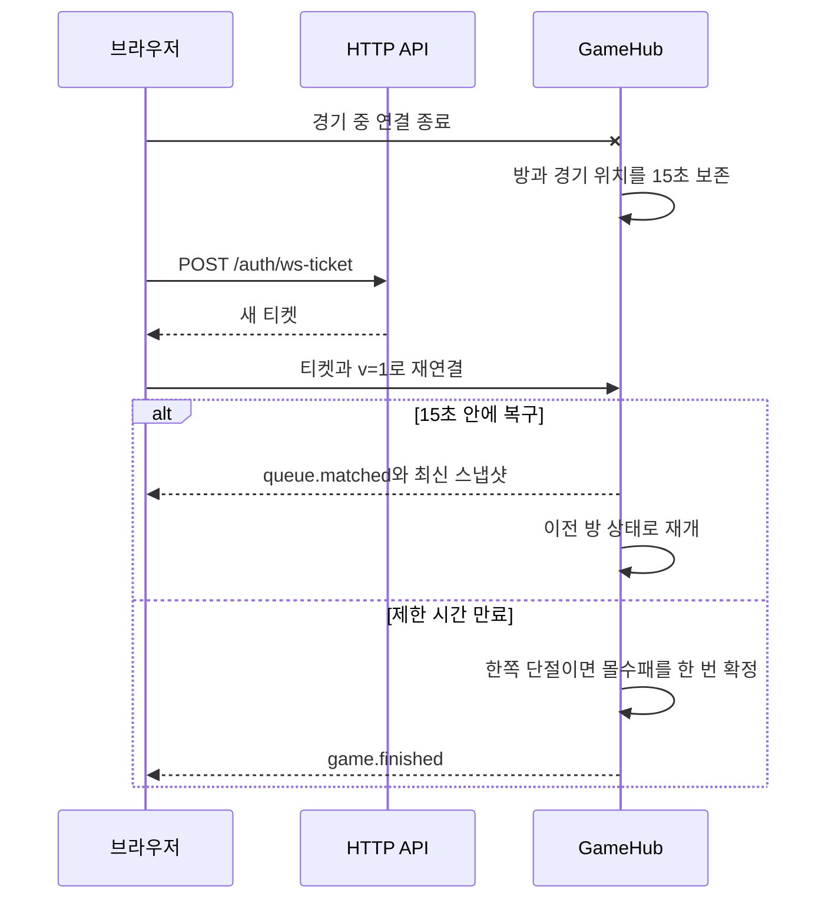

# HTTP와 실시간 프로토콜

API와 웹이 주고받는 공개 형식은 `packages/shared/src/http.ts`, `packages/shared/src/ws.ts`, `packages/shared/src/game.ts`가 기준입니다. 서버 안에서만 쓰는 객체를 응답에 바로 직렬화하지 않고, 송수신 지점에서 Zod 스키마로 확인합니다.

## HTTP 오류와 인증

HTTP 오류 본문은 다음 모양으로 고정합니다.

```json
{
  "error": {
    "code": "validation_error",
    "message": "요청 값을 확인해주세요.",
    "requestId": "req-1",
    "fieldErrors": {
      "displayName": ["값이 너무 깁니다."]
    }
  }
}
```

`fieldErrors`는 입력 검증 오류가 있을 때만 붙습니다. SQL 문자열과 내부 예외 메시지는 응답으로 보내지 않습니다.

브라우저 로그인은 HttpOnly 쿠키만 사용합니다. 로그인 응답에 세션 토큰을 넣지 않으며 웹도 `localStorage`에 인증값을 저장하지 않습니다. `/auth/dev-login`은 development와 test에서만 열리고, 이 경로로 만든 사용자는 사용자 이름(`handle`)과 관계없이 일반 사용자 권한을 받습니다. 관리자 권한은 `seed:dev` 또는 `user:set-role` 명령으로만 바꿉니다.

## WebSocket 연결

1. 브라우저가 쿠키를 포함해 `POST /auth/ws-ticket`을 호출합니다.
2. 서버는 유효 시간이 30초인 임의 티켓을 돌려주고 DB에는 SHA-256 해시만 저장합니다.
3. 브라우저는 `?ticket=...&v=1`로 WebSocket을 엽니다.
4. 서버는 티켓 소비와 사용자 상태 확인을 한 번에 처리합니다. 이미 썼거나 만료된 티켓, 정지된 사용자는 거절합니다.

인증이 끝나기 전에는 메시지 16개 또는 합계 32KiB까지만 잠시 보관합니다. 메시지 하나가 8KiB를 넘으면 바로 닫습니다. URL에는 장기 세션이나 쿠키 값을 넣지 않습니다.

## 버전 1 이벤트

모든 이벤트에는 `v: 1`이 들어갑니다. 주요 페이로드는 다음과 같습니다.

```ts
type Snapshot = {
  roomId: string;
  tick: number;
  sequence: number;
  serverTimeMs: number;
  state: GameState;
};

type Input = {
  v: 1;
  type: "game.input";
  roomId: string;
  inputSeq: number;
  direction: -1 | 0 | 1;
};
```

클라이언트는 마지막으로 적용한 값보다 `sequence`가 작거나 같은 스냅샷을 버립니다. 서버도 사용자와 방별로 마지막 `inputSeq`를 기억해 중복되거나 뒤늦게 도착한 입력을 무시합니다. 입력 허용량은 초당 30개이며 짧은 순간의 초과 입력만 추가로 받습니다.

서버는 15초마다 ping을 보내고 45초 동안 pong이 없으면 연결을 종료합니다. 전송이 밀릴 때는 최신 스냅샷 한 건만 대기시킵니다. `bufferedAmount`가 256KiB를 넘으면 이전 대기 스냅샷을 교체하고, 1MiB를 넘거나 5초 이상 풀리지 않으면 연결을 끊습니다.

## 재접속

같은 사용자가 새 연결을 열면 이전 연결을 대체합니다. 경기 중 연결이 사라졌을 때는 방과 경기 위치를 15초 동안 보존합니다. 클라이언트는 재접속할 때 새 티켓을 발급받고, 서버는 복구된 연결에 기존 방 정보와 최신 스냅샷을 보냅니다.



## 비회원 체험 제한

`APP_MODE=demo`에서는 빈 본문으로 `POST /auth/guest`를 호출합니다. 서버가 표시 이름을 만들고 2시간짜리 서명된 비회원 쿠키를 발급합니다. 비회원은 비회원 또는 AI와만 경기하며 채팅, 친구, 프로필 변경, 토너먼트, 순위표 반영, 관리자 기능을 사용할 수 없습니다.

6초 동안 다른 비회원이 없으면 AI 경기로 전환합니다. 결과는 PostgreSQL에 남기지 않고 `game.finished`에 `persisted: false`, `matchId: null`을 넣습니다. 연결 복구에 필요한 최근 결과만 프로세스 메모리에 2분 보관합니다.
